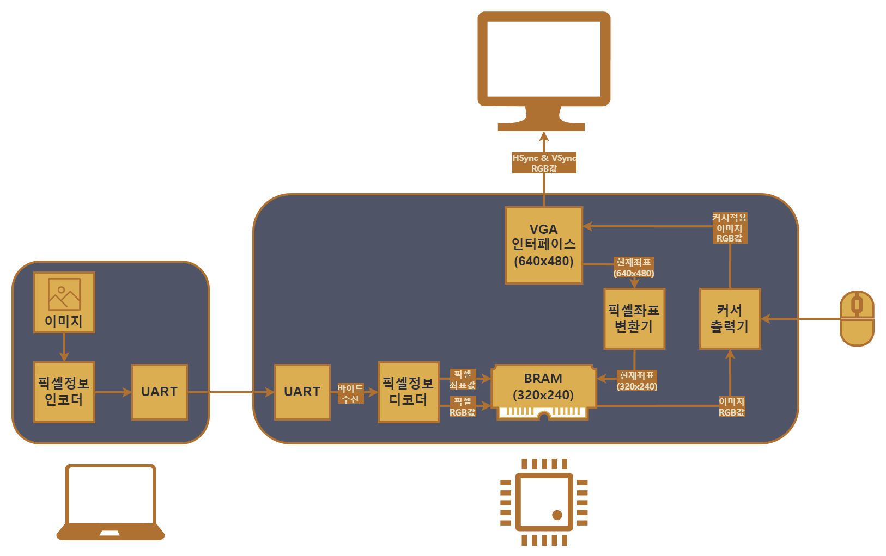

# VGA 인터페이스를 이용한 이미지 및 마우스 커서 출력기
#### 참고: USB 마우스 초기화 코드가 없기 때문에 다른 프로그램 (공장에서 나온 상태의 프로그램) 이 없으면 커서가 동작하지 않을 수 있습니다.

## 데모 사용법
1. `demo_files/TOP_image_and_mouse.bit` 을 이용하여 Basys3에 Bitstream 프로그래밍 하기
2. 프로그래밍 된 보드를 USB UART로 연결
3. 24비트 BMP 준비 (320x240 해상도 추천)
4. `demo_files/bmptx.exe` 이용하여 BMP 파일을 FPGA 보드로 전송
   - 예: `bmptx.exe COM5 bliss.bmp`
------------------
## 모듈 설명

### 모듈 설명
+ VGA 인터페이스: HSync/VSync 와 픽셀 정보 출력 타이밍 제어 및 현재 픽셀 좌표 제공
+ BRAM: 비디오 버퍼 역할
+ 픽셀 좌표 변환기: VGA와 BRAM 사이의 해상도 변환
+ 커서 출력기: 저장 이미지 출력 전 커서 이미지 덧씌운뒤 VGA로 픽셀 정보 전달
+ 픽셀 패킷 수신기: PC로부터 픽셀 정보 수신
